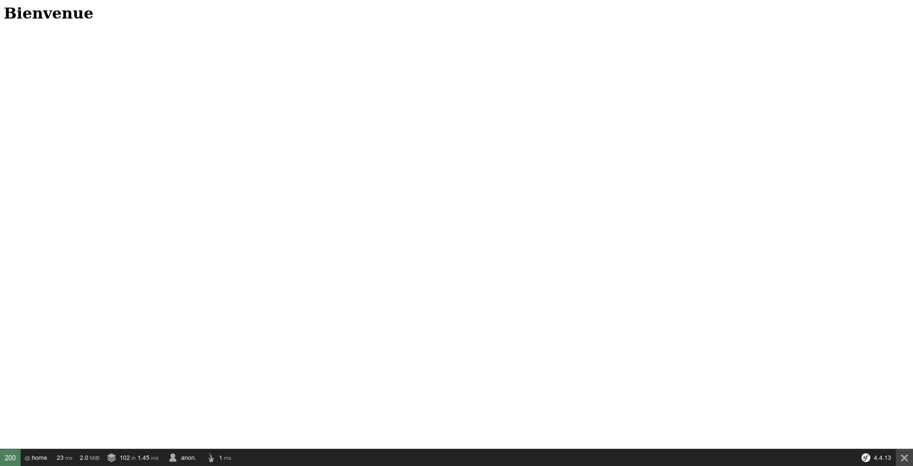

# Symfony Profiler

Le composant profiler est un excellent outil de debug. Il nous permet d'avoir des information utiles sur la façon dont la requête a été traitée et la réponse a été conçue.

## la Toolbar

Si nous regardons notre première page modifiée, nous voyons la toolbar dans le bas. Elle contient quelques blocs d'informations utiles ave dans l'ordre :

1. Le statut de la réponse
2. Les informations relatives à la route et au controller qui a traité la requête
3. Le temps de réponse de Symfony. C'est une donnée très importante et qui est utilisée par Google pour son référencement. Sachez cependant que ce temps de réponse est plus petit en prod qu'en dev.
4. La quantité de mémoire utilisée par PHP pour générer cette réponse.
5. Des informations sur la façon de le cache a été utilisé.
6. Des informations relative à la sécurité (qui est connecté, quel firewall, etc..)
7. Et enfin les données relatives au rendu des différents templates utilisés pour la vue (les seuls templates utilisés ici sont ceux de la toolbar).

Au clic sur un de ses blocs nous pouvons ouvrir la page de profiler qui détaille chacun de ces points. Cette page nous permet aussi de voir le résultat pour les requêtes précedentes au besoin.

Pour plus d'informations je vous [renvoie à la doc](https://symfony.com/doc/4.4/profiler.html).
