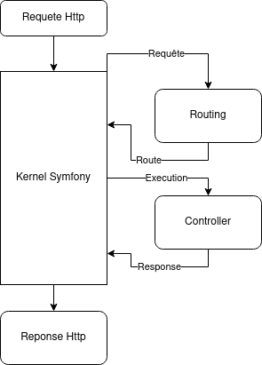

# Les routes dans Symfony

Dans symfony il faut voir une route comme un object qui permettra au composant _Routing_ de faire le lien entre une requête et un controller.

La route a donc besoin de plusieurs propriétés pour faire ce lien. Elles sont liées à la requête, à un controller et à elle mêmes (leur nom).

Vous pouvez trouver la documentation de ce composant [ici](https://symfony.com/doc/4.4/routing.html)

Il s'agit donc d'un des premiers composants utilisé par le kernel de Symfony.

Il demande au _Routing_ si il connait une route correspondant à a requête HTTP reçue. Quand tout va bien il reçoit du _Routing_ un object _Route_ qui renseigne au Kernel la _method_ de _controller_ à executer pou obtenir la bonne réponse HTTP à renvoyer.

## Liste des routes
Il y a un moyen d'obtenir la liste des routes de notre application. Pour cela vous devez vous rendre dans la console et taper la commande suivante:
`php bin/console debug:router`

Vous êtes probablement surpris de voir qu'il ya déjà tout un tas de routes dans notre application. Il s'agit principalement des routes créées par le composant _Profiler_.
 
