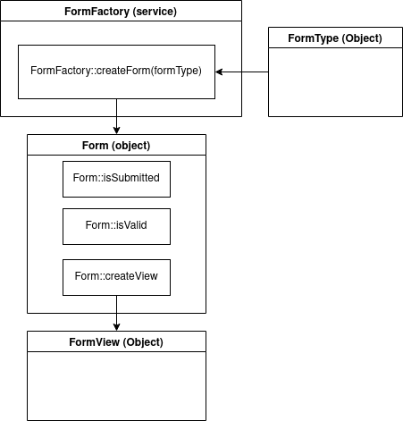

# Les formulaire dans Symfony

Symfony met à notre disposition un component _FormComponent_ qui, comme son nom l'indique, nous permettra de créer des formulaires, de les valider, de les afficher, mais aussi d'hydrater des objets (nos entités par exemple).

Voyons tout cela en détail.

## Les principaux objects du component

Toute notre logique dans l'utilisation du component s'articulera principalement autour de quatre objects distincts.

### FormType

Cet object représente une définition de formulaire, c'est dans cet object que nous déciderons quels champs feront partie du formulaire et quel type d'object sera lié au formulaire (quel object il hydratera).

### FormFactory

Disponible en tant que _Service_ nous utiliserons sa methode `createForm($formType, $dataClass, $options)` pour générer un object `Form` sur base de la définition d'un formType.

### Form

C'est évidemment l'object principal. C'est l'objet qui représentera le form en lui-même. C'est ici que nous appellerons notemment `isSumbmitted()` pour savoir si le form a été soumis, `isValid()` pour savoir si il est valide ou encore `createView()` pour générer un object de type `FormView`

### FormView

C'est la version _affichable_ du `Form`. Cet object aura des `children` qui représenteront les champs affichables du formulaire.

  
  
