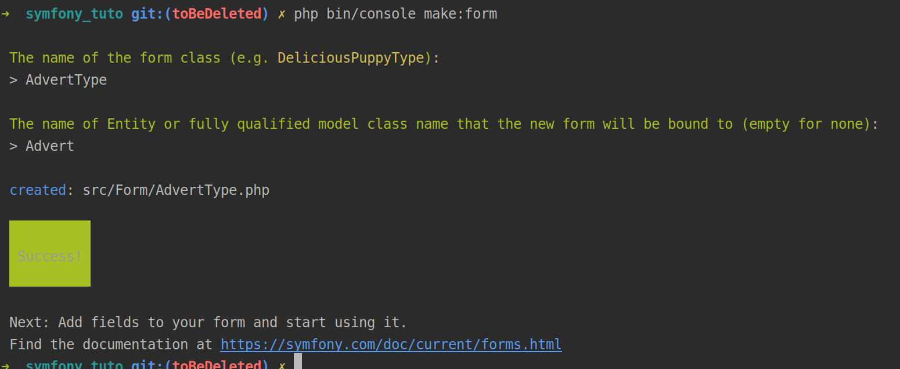

# Les FormType

Comme le nom l'indique, ce sont les types de formulaires dont nous auront besoin. Ils sont toujours liés à une class (le `data_class`) qui sera le type d'object à hydrater avec les données du formulaire.

## Créer un FormType sur base d'une Entity

Pour générer un `FormType` nous pouvons utiliser le maker de Symfony. Imaginons que nous ayons une `Entity` très basique représentant une annonce.

 ```
// ...
/**
 * @ORM\Entity(repositoryClass=AdvertRepository::class)
 * @ORM\HasLifecycleCallbacks()
 */
class Advert
{
    /**
     * @ORM\Id
     * @ORM\GeneratedValue
     * @ORM\Column(type="integer")
     */
    private $id;

    /**
     * @ORM\Column(type="string", length=255)
     * @Assert\NotNull()
     * @Assert\Length(min="20")
     */
    private $title;

    /**
     * @ORM\Column(type="float")
     */
    private $price;

    /**
     * @ORM\Column(type="text")
     * @Assert\Length(min="50")
     */
    private $description;

    // ...
```

Pour générer un `FormType` pour nos `Advert` nous allons simplement dans la console et tapons la commande `php bin/console make:form`. Nous répondons aux questions du Wizard et c'est tout.



Nous pouvons nous rendre dans le nouveau dossier créé `src/Form` et ouvrir le nouveau fichier créé `AdvertType`.

```
class AdvertType extends AbstractType
{
    public function buildForm(FormBuilderInterface $builder, array $options)
    {
        $builder
            ->add('title')
            ->add('price')
            ->add('description')
        ;
    }

    public function configureOptions(OptionsResolver $resolver)
    {
        $resolver->setDefaults([
            'data_class' => Advert::class,
        ]);
    }
}

```

Que voyons-nous ? D'abord notre class `AdvertType` hérite de `AbstractType`, c'est ce qui en fait un `FormType` utilisable.

Ensuite nous surchargons deux method de notre class parent: Dans `::buildForm` nous allons déclarer une liste de champs (qui correspondent aux noms des propriétés de notre entité) et dans `::configureOptions` nous déclarerons la classe attendue qui représentera les données du formulaire.

## La method FormbuilderInterface::add
C'est en fait la partie qui nous intéresse le plus à ce niveau : c'est la methode qui nous permet d'ajouter des champs à nos formulaires.

allons de ce pas voir sa définition : 
```
/**
 * Adds a new field to this group. A field must have a unique name within
 * the group. Otherwise the existing field is overwritten.
 *
 * If you add a nested group, this group should also be represented in the
 * object hierarchy.
 *
 * @param string|FormBuilderInterface $child
 * @param string|null                 $type
 *
 * @return self
 */
public function add($child, $type = null, array $options = []);
```

Nous avons trois paramètres.
#### Paramètre child
Nous nous en servirons pour donner l'identifiant de notre champ. La plupart du temps il s'agira du nom d'une propriété de notre object.

#### Paramètre type
Le type nous permet de définir le formType de notre champ (oui il s'agit aussi d'un formType, on en reparlera plus loin). Si on laisse null, le component va tenter de deviner quel _Type_ correspond le mieux à notre champ.

#### Paramètre options
Il s'agit d'un taleau d'option dans lequel nous pouvons mettre tout un tas de choses, dont notemment les attributs des balises qui seront générées ou encore des propriétés typiques du `FormType` demandé. Par exemple pour un `DateType` nous pouvons donner un format spécifique. 

## Les types natifs du FormComponent

Comme nous venons de le voir aux champs (`children`) d'un `FormType` sont aussi assigné des `FormType`. Le plus souvent nous utilisons simplement les `FormType` natifs du component. Nous avons la liste complète ici, je ne vais donc pas les revoir en entier : https://symfony.com/doc/4.4/reference/forms/types.html

Simplement sachez que pour avoir un `<textarea>` plutôt qu'un `<input type="text" />` pour notre champ description, nous devrons le modifier comme ceci :

`->add('description', TextareaType::class)`

### EntityType

Je voudrais parler quand même un minimum de l'`EntityType`. C'est un `FormType` spécifique aux relations entre entités. Il est basé sur le le `ChoiceType` qui peut avoir comme rendu un `<select>` multiple ou non, un `<input type="radio">` ou un `<input type="checkbox">`.

Nous devons juste lui préciser quelle `Entity` y est attachée et quel type de rendu nous voulons.

Imaginons une propriété sur notre `Advert`

```
/**
 * @ORM\ManyToOne(targetEntity=Category::class)
 * @ORM\JoinColumn(nullable=false)
 */
private $category;
```

Dans le formulaire nous pourrions faire quelque chose du genre pour afficher un select avec l'ensemble des categories de notre DB dans les options:

`->add('category', EntityType::class, ['class' => Category::class])`

Pour l'afficher sous forme de radio il faut ajouter une option :

`->add('category', EntityType::class, ['class' => Category::class, 'expended' => true])`

Si nous avions aussi des tags en `ManyToMany` voici comment nous ferions :
 ```
/**
 * @ORM\ManyToMany(targetEntity=Tag::class)
 */
private $tags;
```
Pour le formulaire nous devrions faire :

`->add('tags', EntityType::class, ['class' => Tag::class, 'multiple' => true])`

