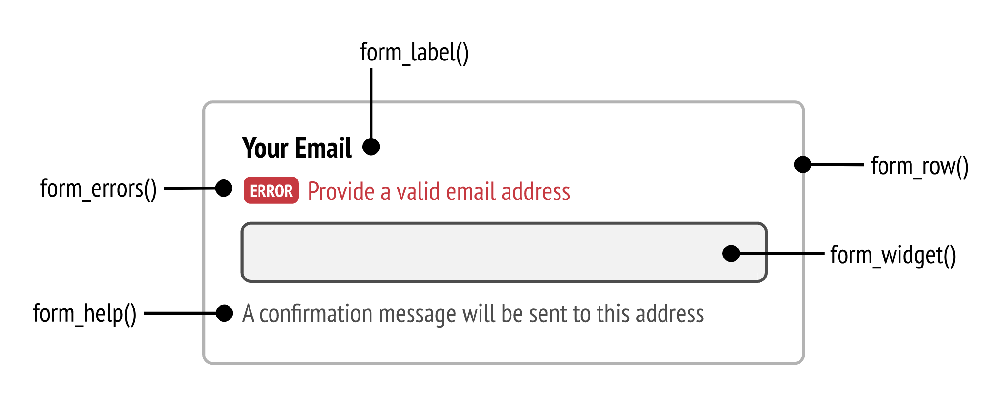

# Affichage du form

Nous disponsons de plusieurs fonctions dans Twig pour l'affichage d'un formulaire. Nous avons déjà vu `form()` qui déclenche l'affichage par défaut de tous les enfants du form dans l'ordre.

Toute la documentation se trouve ici : https://symfony.com/doc/current/form/form_customization.html

## Sous fonctions de form()

En fait cette function `form()` est une super function qui en apelle d'autres.

### form_start() et form_end()
Est la function utilisée pour afficher la balise d'ouverture `<form>`. Pour la fermeture il y a son équivalent `form_end()`.

### Les éléments du formulaire.

Pour bien comprendre comment ça se passe, il faut bien visualiser la décomposition d'un élément de formulaire par symfony. Dans la doc il fournissent cette image qui est très claire :



Nous voyons bien comment est rendu un élément de formulaire. nous pouvons rendre l'ensemble de l'élément avec la function `form_row()` ou rendre chaque élément séparément avec les function dédiées: 

- `form_label()` va afficher le label d'un élément
- `form_errors()` va afficher des erreurs éventuelles de validation sur le champ
- `form_widget()` va afficher l'élement en lui même : la balise input, textarea, select,..
- `form_help()` va afficher le message d'aide de l'élément. Nous n'en avions pas encore parlé. Il s'agit d'une option présente dans les `FormType` natifs de Symfony. `$builder->add('email', null, ['help' => 'Make sure to add a valid email']);`. La doc se trouve ici : https://symfony.com/blog/new-in-symfony-4-1-form-field-help


### form_rest()

Cette petite est bien pratique. Elle sert à afficher tous les élements du formulaire qui n'ont pas encore été rendus (avec un `form_row()` par exemple), et la fermeture du `form`. Ca permet par exemple de ne pas oublier de rendre l'input hidden du csrf_token.


## Les themes de formulaires

Pour customiser le rendu d'un formulaire, le _FormComponent_ dispose de thèmes de formulaires. https://symfony.com/doc/current/form/form_themes.html 

Par défaut il en existe déjà quelques uns mais ceux qui vont probablement le plus vous intéresser sont les deux associés à Bootstrap4 : bootstrap_4_layout.html.twig et bootstrap_4_horizontal_layout.html.twig. Il existe aussi les variantes pour les différentes version de Foundation (concurrent de Bootstrap).

### Appliquer les thèmes à nos form.
Pour choisir quel thème va s'appliquer par défaut à tous nos forms il faut alelr dans al configuration de Twig : 

```
# config/packages/twig.yaml
twig:
    form_themes: ['bootstrap_4_horizontal_layout.html.twig']
```

Et c'est tout. 

Pour appliquer un thème différent à un form spécifique, nous le ferons depuis twig avant son rendu :

```


{{ form_start(form) }}
    {# ... #}
{{ form_end(form) }}
```

Nous pouvons évidemment, pour une utilisation avancée, modifier ces thèmes ou en créer de nouveau. Nous ne le verrons pas dans ce cours mais [la documentation est comme d'habitude bien faite et disponible](https://symfony.com/doc/current/form/form_themes.html#creating-your-own-form-theme). 
  
